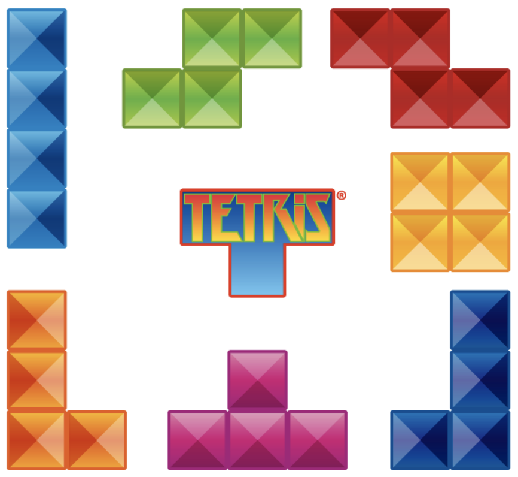

# Fillit

Fillit is a project allowing you to discover and/or familiarize yourself with
a recurring problem in programming: the search for an optimal solution
among a very large number of possibilities, within a reasonable time. In the case of this
project, it will be a question of arranging Tetriminos between them and determining the smallest square
possible to accommodate them.

